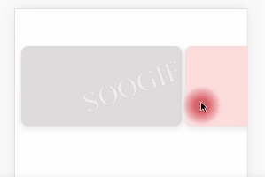

# fold-scroll
基于vue2.x的H5横向折叠滑动组件样式实现
* 滑动过程伴随伸缩和透明度变化
* 支持阈值内滑动复位


<video id="video" controls="" preload="none" poster="./public/pic1.png">
  <source id="mp4" src="./public/fold-demo.mp4" type="video/mp4">
</video>

<figure class="third">
  
</figure>


### Usage Example
In your project, you can import fold-scroll package with npm or yarn
```js
npm i fold-scroll / yarn add fold-scroll
```

```vue
<FoldScroll :cardNum="5" :cardWidth="260" :slideDistance="100">
  <template v-for="(item, idx) in cardList" :slot="idx">
    <div class="demo-item" :key="idx" :style="{ backgroundColor: getColor(idx) }">
    </div>
  </template>
</FoldScroll>

<script>
import FoldScroll from 'fold-scroll'

export default {
  components: {
    FoldScroll,
  },
  data() {
    return {
      cardList: [{}, {}, {}, {}, {}]
    }
  },
  methods: {
    getColor(idx) {
      let color = ['#e0e0e0', '#ffe0e0', '#e0ffe0', '#e0e0ff']
      return color[idx] ?? this.getColor(idx - 4)
    }
  }
}
</script>
```

### Props

| 参数 | 说明 | 类型 | 默认值 | 必选 | 可选值 |
| --- | --- | --- | --- | --- | --- |
| cardNum | 传入的卡片数量 | number | true | N | - |
| cardWidth | 卡片的宽度 | number | false | N | 建议大于屏幕宽度的一半 |
| slideDistance | 滑动阈值（超过该距离则折叠滑动，不超过则复原） | number | false | N | - |

### Events

| 事件 | 说明 | 参数 |
| --- | --- | --- |
| triggerThreshold | 滑动到阈值的时候触发该事件 | {currentIndex, direction} 触发滑动时的卡片序号， 滑动方向（-1为左， 1为右） |
| triggerSlideLeft | 触发左滑折叠时触发该事件 | currentIndex 触发滑动时的卡片序号 |
| triggerSlideRight | 触发右滑折叠时触发该事件 | currentIndex 触发滑动时的卡片序号 |


